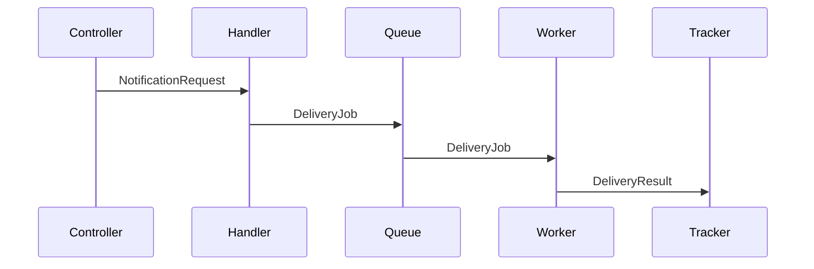

# Design-First Methodology Detail

Expanded ref for 5-level progressive design methodology. Use for notation guide, interface patterns, understand good vs poor output each level.

## Good vs Poor Output by Level

### Level 1: Capabilities

**Good** -- scoped, user-facing, no implementation detail:
1. Users receive email notifications when their order ships
2. Users can view notification history in their account
3. Failed deliveries are retried automatically

**Poor** -- leaks implementation detail or scope creeps:
1. A NotificationService class sends emails via SendGrid
2. A Redis-backed queue handles retry with exponential backoff
3. Users can configure notification preferences (SMS, email, push)
4. Analytics dashboard tracks delivery rates

Poor version names tech (Level 2+), describes internal mechanisms (Level 3+), adds features not requested (scope creep).

### Level 2: Components

**Good** -- named building blocks with single responsibilities:
- **NotificationHandler**: Receives notification requests, validates payload, queues for delivery
- **EmailDeliveryWorker**: Processes queued notifications, sends via configured provider
- **DeliveryTracker**: Records delivery status, surfaces history for user queries

**Poor** -- includes interaction patterns or implementation:
- **NotificationHandler**: Receives requests, validates payload, *calls EmailDeliveryWorker.send()*, *stores result in DeliveryTracker database*

Poor version describes how components talk (Level 3) and how store data (Level 5).

### Level 3: Interactions

**Good** -- what passes between components, not how:
1. Controller → NotificationHandler: `NotificationRequest` (recipient, template, variables)
2. NotificationHandler → Queue: `DeliveryJob` (provider, recipient, rendered content)
3. Queue → EmailDeliveryWorker: `DeliveryJob`
4. EmailDeliveryWorker → DeliveryTracker: `DeliveryResult` (status, timestamp, error if failed)

**Poor** -- includes method signatures or implementation:
1. Controller calls `handler.processNotification(req: NotificationRequest): Promise<void>`
2. Handler calls `queue.add('email', job, { attempts: 3, backoff: { type: 'exponential' } })`

Poor version defines function signatures (Level 4) and config detail (Level 5).

### Level 4: Contracts

**Good** -- typed interfaces, no function bodies:
```typescript
interface NotificationPayload {
  recipient: string;
  template: string;
  variables: Record<string, string>;
}

interface DeliveryResult {
  status: 'sent' | 'failed' | 'pending';
  timestamp: Date;
  error?: string;
}

interface EmailProvider {
  send(payload: NotificationPayload): Promise<DeliveryResult>;
}
```

**Poor** -- includes implementation logic:
```typescript
interface EmailProvider {
  send(payload: NotificationPayload): Promise<DeliveryResult>;
}

// Implementation
class SendGridProvider implements EmailProvider {
  async send(payload: NotificationPayload): Promise<DeliveryResult> {
    const response = await sendgrid.send({ to: payload.recipient, ... });
    return { status: 'sent', timestamp: new Date() };
  }
}
```

Poor version includes class body -- belongs Level 5.

## Collapsed vs Progressive: Same Feature, Two Approaches

**Collapsed** (single prompt → implementation): AI receives "build notification service", produces 400 lines code. Chose wrap BullMQ in custom RetryQueue abstraction. Added webhook notification channel. Defined interfaces inline within implementation. Dev must evaluate scope, architecture, integration, contracts, code quality -- all at once.

**Progressive** (5 levels → implementation): Level 2, dev catches unnecessary RetryQueue wrapper -- BullMQ already handles retries natively. Level 1, webhook channel flagged out of scope. Level 4, interfaces agreed before any code. Level 5, implementation smaller, better integrated, already reviewed every design dimension.

Progressive approach not take longer overall. Two-min conversation Level 2 that removes unnecessary abstraction saves thirty min reviewing, testing, maintaining code that wraps functionality framework already provides.

## Sequence Diagram Notation

For Level 3 interactions, use ASCII or Mermaid. Both acceptable; choose whichever clearer for specific design.

**ASCII notation**:
```
Controller  →  Handler  →  Queue  →  Worker  →  Tracker
   |              |           |          |          |
   |--request---->|           |          |          |
   |              |--job----->|          |          |
   |              |           |--job---->|          |
   |              |           |          |--result->|
```

**Mermaid notation**:


Label each arrow with data that passes -- not method name, not implementation detail. Focus *what* moves between components.

## Interface Definition Patterns

Level 4, contracts should be:

- **Minimal**: Only interfaces needed formalize agreed interactions. No utility types, no helper interfaces.
- **Self-documenting**: Type names and method names make purpose obvious without comments.
- **Aligned with Level 3**: Every interaction from Level 3 has corresponding interface or type. No new interactions appear Level 4.
- **Language-appropriate**: Use project's language conventions. TypeScript interfaces for TS projects, Python protocols/ABCs for Python, Go interfaces for Go.